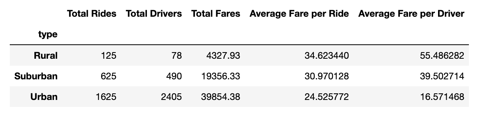
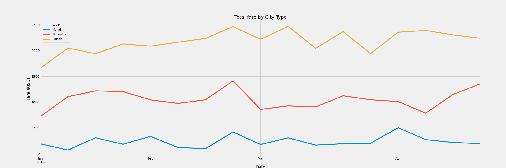

# A Written Report for the PyBer Analysis

## Overview of Analysis

### Purpose
The objective of this analysis is to create a multiple-line graph that shows the total weekly fares for each city type and present how the data differs by city  and how those differences can be used by decision-makers at PyBer. PyBer operates in three city types: Urban, Suburban and Rural.. The CEO of V.isualize gave Omar and I the task to compare the fares and it´s average per ride and driver, among the 3 types of cities mentioned above. This analysis will help in the future when making decisions on how to improve the comapny's sysytem.

## Results
### Total Rides
 From the analysis, we can see that actually there is a big difference gap among the city´s types. Urban cities had most number of rides with 1625 rides, while Suburban cities had 625 rides. Rural cities were the leats with 125 rides.
 
 ### Total Drivers and Fares
 We can see that the total rides are directly proportional to the total drivers and fares. It is expected that in a city type that has more drivers, the total rides and fares would be higher compared to other city types. As we can see the Urban city type would be booming with more businesses, big companies, high real estate developments and institiutions. Therefore, there would be a higher demand of services in the Urban city than the Suburban and Rural city.  The next city that follows Urban city is the Suburban city. The direct proportion trend can be seen in this city type, as well as, the Rural city type. The least total drivers and fares are seen in the Rural city. We can say it can be attributed to the lower demand of services and socioeconomic level of the population who reside in that part of the city.
 
 ### Average Fare Per Ride and Per Driver
 Interestingly, the population in the Rural city seem to pay more on an average compared to the Urban and Suburban cities. This can be linked to the distance of travel. Probably, the Rural city is far from the Urban and Suburban cities, so the fare of the ride would be more if the distances are long. The Urban city pays the least in both the average fares per ride and driver.
 
 This can be seen in the table and chart below:

## Summary
The first business suggestion is the plan to reduce the cost of rides in Rural areas. This would be a great opportunity because it would prevent the company from losing customers in the Rural city, and it would show customer appreciation. Secondly, adding a scheduled pick-up option for placing a ride. This would be a great add-on especially for those who live in the Urban city. The Urban cities are usually fast-paced and are most likely to have rush hours and traffic. Having this option would give people the opportunity to get to where they need to be on time. Lastly, adding new features like food delivery servcies and package delivery to PyBer can make the company business grow exponentially, in turn providing for more job opportunites in the community.
